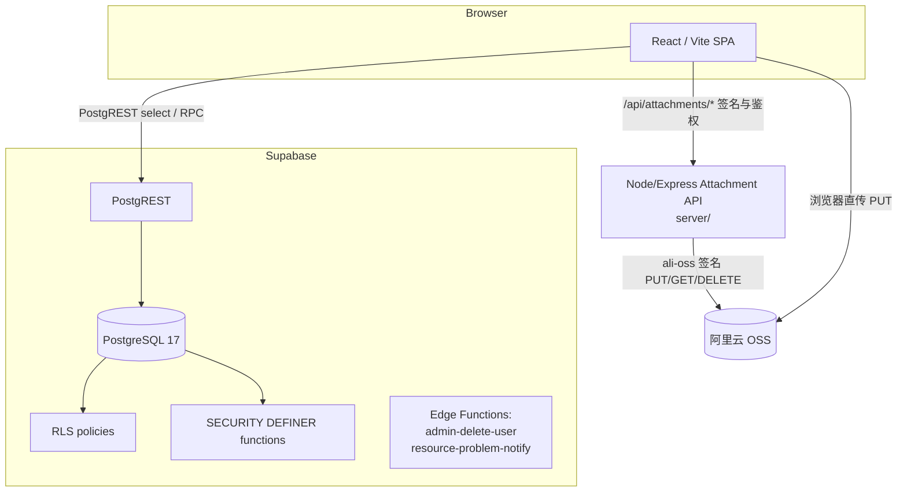

# OKR 管理系统技术交接报告（PROJECT HANDOVER）

> 面向第一次接触本项目的开发者。本文以**当前代码仓库的真实实现**为准，不依赖 README 或历史设计文档的二手描述。若你读到与代码冲突的地方，以本文末尾标注的源码路径和 `main` 分支当前状态为准。

| 项目 | 值 |
| --- | --- |
| 仓库 | `time-tech-spectra-okr`（瞬谱光电 · TIME-TECH SPECTRA OKR） |
| 基准分支 | `main`（具体 HEAD 以交接时的 `git log -1` 为准） |
| 前端 | React 19 + TypeScript + Vite + React Router 7 |
| 后端/数据 | Supabase（Postgres 17 + PostgREST + RLS + SECURITY DEFINER RPC） |
| 附件存储 | 阿里云 OSS（经一个 Node/Express 签名服务，不是 Supabase Storage） |
| 运行模式 | `demo`（内存 mock）与 `supabase`（真实数据）双模式 |
| 语言 | 中文优先，可即时切换 English（`src/i18n`） |

---

## 1. Executive Summary

这是一个**面向公司内部的 OKR 管理系统**，不是 demo/原型，而是一个 production-oriented 系统：它同时承载

- Objective / Key Result 管理与季度进度追踪（含进度历史、风险事件矩阵）
- 项目（Project）与成员管理
- 结构化日报（Daily OKR Report）：一个员工一天可写多组 Daily OKR block，每组关联一个季度 KR、记录工时、结果与附件
- 周报入口（Weekly Report，仅读）
- 工时统计（Employee / Project Leader / Management / HR 四层可见范围）
- HR 专属工作区：HR Objective、HR 工时总览
- Dashboard（按角色渲染不同 widgets）
- 权限与角色体系（administrator / management / project_leader / employee / hr）
- 文件附件（含上传会话、修订历史、下载鉴权）
- 数据可视化（对齐树、甘特、进度趋势、工时）

系统的安全边界是**数据库 RLS + 受限 RPC**，前端权限检查只是 UI 层的镜像，不是安全边界。

---

## 2. Current Status

- **分支**：`main`
- **基准分支**：`main`（不要依赖文档中容易过期的固定 commit SHA）
- **working tree**：接手时必须重新运行 `git status --short`，不要假设为 clean
- **最近主要 commits**（`git log --oneline -30` 中的核心推进）：
  - `43efd91 fix: enforce block-level daily report access and restore DB guards`
  - `53a1e89 wip: fix HR OKR migration ambiguity`（**本次 drift 的源头**，见 §23）
  - `b7badf1 test: align optional KR coverage with project attribution`
  - `dbce7d5 fix: scope recorded hours by author and led projects`
  - `509f992 feat: map daily block project attribution`
  - `43e7c18 feat: secure daily work attribution by project`
  - `784d27a feat: HR OKR execution, work-hours overview, optional-KR daily reports`

### 各开发方向完成度

#### HR OKR —— 已完成
- HR 专属 Objective（`objectives.objective_type = 'hr'`）✅
- 多 HR Owner（`objective_owners`，不是塞进 `objectives.owner_id`）✅
- HR 创建/编辑 KR ✅（`create_key_result`/`update_key_result` 对 HR Objective 走 `is_hr_objective_owner` 分支）
- HR KR owner 限制 ✅（HR KR 的 owner 只能是 HR，`is_eligible_hr_kr_owner`）
- HR OKR visibility ✅（普通 HR 只能读 HR Objective；business Objective 走 `can_read_business_subject` 的 `not has_role('hr')` 边界）
- HR 工作工时总览 ✅（`get_hr_work_hours`，仅投资行、无正文/附件）

#### Daily Report —— 已完成
- 所有组织角色可填自己的日报 ✅（前端 `daily_report.create` 对 owner==self 放行；但见 §13/§17 的 DB 层 project 归属约束）
- KR 关联 optional ✅
- 不关联 KR 时提醒但允许提交 ✅（`showKrReminder` 非阻塞弹窗）
- Daily block project attribution ✅（`daily_okr_blocks.project_id`）
- 不同 block 可归属不同 project ✅
- Project Leader 日报读取边界 ✅（**block-level**，见 §14）
- Management 日报无需审批 ✅（`can_review_daily_report` 排除 management 作者）
- Admin 日报 ✅（前端任意角色可写；但见 §13 的 DB 约束缺口）
- 日报附件 ✅（OSS，见 §16）
- revision history ✅（`list_report_revisions`）
- review / confirm ✅（`comment_daily_report` / `confirm_daily_report`）

#### Work Hours —— 已完成（结构工时）
- Employee：仅本人
- Project Leader：本人 + 所负责项目的成员 block
- Management：组织级
- HR：`get_hr_work_hours`（结构化工时，无正文/附件）

---

## 3. 系统架构



- 前端通过 **Supabase client** 直接与 PostgREST 通信（`src/data/supabaseRepository.ts`）：读走 `select`（受 RLS），写走 `.rpc(...)`（受 SECURITY DEFINER 函数内部的鉴权）。
- 附件字节**不走 Supabase Storage**：`server/`（Express）签名阿里云 OSS 直传 URL；数据库只保存元数据。生产路径已关闭 Supabase Storage 的 attachment policy（`202608240005_daily_report_storage_lockdown.sql`）。
- Edge Functions：`admin-delete-user`（删用户）、`resource-problem-notify`（资源问题通知）。**不要假设有其它 Edge Function。**

---

## 4. Frontend Architecture

### Framework / 版本（以 `package-lock.json` 解析为准，非 `package.json` 的 `latest`）

| 包 | 版本 |
| --- | --- |
| react / react-dom | 19.2.8 |
| react-router-dom | 7.18.2 |
| typescript | 7.0.2 |
| vite | 8.2.1 |
| vitest | 4.1.10 |
| @supabase/supabase-js | 2.112.3 |
| recharts | 3.10.1 |
| express | 5.2.1 |
| ali-oss | 6.23.0 |
| docx | 9.7.1 |

> ⚠️ `package.json` 里大量依赖写的是 `latest`（react、react-dom、react-router-dom、typescript、vite、vitest 等），锁文件目前是 `19/7/8`。**建议交接后把版本固定为精确版本**，否则重装 `npm install` 会漂移。

### 目录职责

| 目录 | 职责 |
| --- | --- |
| `src/pages/` | 页面（`DailyReportsPage`、`OkrManagementPage`、`ObjectiveDetailPage`、`hr/HrWorkHoursPage`、`UsersPage`、`ProjectsPage`、`ResourcesPage`、`ReportsPage`、`TeamPage` 等） |
| `src/pages/daily-report/` | 日报表单、详情弹窗、附件、修订历史、打印 |
| `src/pages/okr/` | Objective/KR 表单 modal、进度编辑 |
| `src/pages/hr/` | HR 工时页 |
| `src/components/` | 通用 UI（DataTable、MetricCard、StatusBadge、PermissionGate、ConfidentialityBadge、ExportGuard 等） |
| `src/dashboard/` | 仪表盘：`dashboardRegistry`（角色→widget 映射）、`DashboardGrid`、`widgets/` |
| `src/domain/` | **纯业务逻辑与类型**（`types.ts`、`permissions.ts`、`okrPermissions.ts`、`dailyEntry.ts`、`hrWorkHours.ts`、`progressStatus.ts` 等），无 I/O |
| `src/data/` | 数据层：`types.ts`（数据契约）、`supabaseRepository.ts`、`demoRepository.ts`、`permissionSource.ts`、`useDashboardData.ts`、`repositoryFactory.ts` |
| `src/auth/` | 鉴权：`permissionService.ts`（前端权限求值）、`SupabaseAuthProvider.tsx`、`PermissionGate.tsx`、登录/注册/找回/审批流 |
| `src/lib/` | 环境读取与 repository 单例（`supabase.ts`） |
| `src/i18n/` | 消息表（`messages.ts`）、`LocaleProvider`、错误映射 |
| `src/mocks/` | demo 种子数据 |
| `server/` | Node/Express 附件签名服务（独立于前端构建，`server:build` → `dist-server`） |
| `scripts/` | 构建/校验脚本 + `legacy-upgrade/`（迁移收敛回归，见 §23） |
| `supabase/migrations/` | SQL 迁移（42 个） |
| `supabase/tests/` | pgTAP 测试（21 个） |

---

## 5. Data Layer

### 核心类与文件

- `SupabaseOkrRepository`（`src/data/supabaseRepository.ts`）——生产仓库，实现 `OkrRepository` 接口。
- `DemoOkrRepository`（`src/data/demoRepository.ts`）——demo 仓库，内存可变副本。
- `repositoryFactory.createRepository({ mode, ... })`——按 `VITE_APP_MODE` 二选一。
- `buildPermissionSource(data)`（`src/data/permissionSource.ts`）——从 `DashboardData` 反推前端权限求值器所需的 `projectMemberships / objectives / krAssignments / objectiveOwners / workloads`。
- `useDashboardData(repository, userId)`（`src/data/useDashboardData.ts`）——页面获取数据的统一 hook。

### 页面如何获取数据

`DashboardPage`、`DailyReportsPage`、`OkrManagementPage`、`ObjectiveDetailPage` 等页面调用 `useDashboardData`（或直接 `repository.getDashboardData()`），得到 `DashboardData`（`src/data/types.ts`）。`getDashboardData` 里：

- 一次 `Promise.all` **并行发起 17 个查询**（`list_organization_users` RPC + 16 个表 `select`）。
- 每个表受 RLS，只会返回调用者可见的行。
- 前端把 Supabase row 映射为 domain type（`mapProfile`、`mapDailyReportDetailBlock` 等）。

### DashboardData 如何构建

`DashboardData` 是**共享生产数据契约**（定义在 `src/data/types.ts`，不是 demo mock）。`SupabaseOkrRepository.getDashboardData` 构建它：

1. 读 `profiles`（`list_organization_users`）+ 各业务表
2. `clearancesByProfileId` 补全 clearance
3. `currentUser = users.find(id == session.user.id)`
4. map objectives / keyResults / projects / milestones / risks / progressSnapshots / krAssignments / objectiveOwners / krProgressUpdates
5. 按 `daily_report_revisions` 解析**当前修订**的 blocks，并把附件归到对应 block（`attachmentsByBlockId`，兼容 legacy `legacyAttachmentsByReportId`）
6. `dailyReports` 的 `projectId` 缺省时，从第一个已关联 KR 反推 `projectIdForKeyResult`（见 §12 的 report-level vs block-level）
7. `configurePermissionSource(buildPermissionSource(dashboardData))` —— **这一步很关键**：把 RLS 已披露的项目成员关系喂给前端权限求值器，否则 `hasProjectRole` 匹配空数组，Project Leader 会失去成员日报/工时可见性。

### Repository pattern 作用 / demo vs production

- `demo`：不构造 Supabase client、不写库；`RoleSwitcher` 可切换五种身份；`getHrWorkHours` 返回空。
- `supabase`：真实身份与数据；`RoleSwitcher` 隐藏；所有写走 RPC。
- 两者实现同一 `OkrRepository` 接口，页面无感知。

> ⚠️ `SupabaseOkrRepository.getDashboardData` 把 `workloads`、`attachments`、`companyObjectives`（除 project_id 为 null 的 objective 外）、`projectTasks` 置为空。**HR 仪表盘的 `HrSummaryWidget` 依赖 `workloads`，在 supabase 模式下恒为空** —— HR 的结构化工时实际由 `/hr-hours` 页（`get_hr_work_hours`）承载，不是 dashboard widget。

---

## 6. Authentication & Authorization（角色体系）

角色枚举：`administrator` / `management` / `project_leader` / `employee` / `hr`（DB enum `app_role`，见 `src/domain/types.ts:3`、`user_roles`）。

### 角色权限矩阵（按代码实现）

| Feature | Admin | Management | Project Leader | Employee | HR |
| --- | --- | --- | --- | --- | --- |
| 创建 Objective | — | ✅（仅 management） | — | — | — |
| 编辑 Objective | — | ✅ | — | — | — |
| 归档/恢复 Objective | — | ✅ | — | — | — |
| 创建/编辑 KR（business O） | — | — | ✅（该 O 的 owner/leader） | — | — |
| 创建/编辑 KR（HR O） | — | — | — | — | ✅（该 O 的 HR owner） |
| 更新 KR 进度 | — | — | ✅（leader 或 KR owner） | ✅（KR owner） | ✅（HR KR owner） |
| 写自己日报 | ✅ | ✅ | ✅ | ✅ | ✅（前端） |
| 读团队成员日报 | — | ✅（组织级） | ✅（block 归属其项目） | — | — |
| Review（评论+确认）日报 | — | ✅（他人日报） | ✅（block 归属其项目） | — | — |
| HR 工时总览 | — | — | — | — | ✅（仅结构化） |
| 管理用户/角色 | ✅ | — | — | — | — |

**依据**：前端 `src/auth/permissionService.ts` 的 `roleActions` + `can()`；domain `src/domain/okrPermissions.ts`；后端 `supabase/migrations` 中的 RLS/RPC。三者要交叉看，因为它们是三层表达同一套规则。

要点（易踩坑）：

- **Admin 不是 Management**：admin 没有 `okr.update`/`daily_report.review`/`record.export`，也不读业务正文（`can()` 末尾 admin 只有"同项目成员"才放行）。`can_create_objective` 仅 `management`。
- **HR 不是所有日报的默认 viewer**：`can_read_report_detail` 只放 author/management/project-leader/objective-owner，**不含 HR**。
- **HR 读 OKR 有专门分支**：`can()` 里 `user.role === 'hr'` 时，`okr.read_*` 只放 `objectiveType === 'hr'` 的 Objective，或自己 owner 的 KR（`permissionService.ts:519-533`）。

---

## 7. 前端权限 vs 数据库权限（双层权限）

```
Frontend permissionService.can()      —— UI 层：隐藏按钮/菜单/过滤，不构成安全边界
         +
PostgreSQL RLS / SECURITY DEFINER RPC —— 真正的权限，每次读写在 DB 复核
```

> 前端隐藏按钮不是安全边界。真正阻止越权的，是 RLS（读）与 RPC 内部鉴权（写）。

关键文件：

- 前端：`src/auth/permissionService.ts`、`src/domain/permissions.ts`、`src/domain/okrPermissions.ts`、`src/auth/PermissionGate.tsx`、`src/components/ExportGuard.tsx`
- 后端：`supabase/migrations/*.sql` 中的 `private.*` helper 与 `public.*` RPC

后端 helper（以实际函数名为准）：`private.can_read_business_subject`、`private.can_read_report_detail`、`private.can_read_daily_report_block`、`private.can_review_daily_report`、`private.can_review_daily_report_block`、`private.can_hr_read_objective`、`private.is_kr_assignee`、`private.is_kr_owner`、`private.is_hr_objective_owner`、`private.is_eligible_hr_kr_owner`、`private.is_objective_kr_assignee`、`private.has_role`、`private.has_clearance`、`private.is_operational`、`private.current_organization_id`、`private.current_profile_id`、`private.resolve_daily_report_block_project`、`private.daily_report_is_editable` 等。

---

## 8. OKR 数据模型

### Objective

核心列（`public.objectives`）：`id, organization_id, project_id, owner_id, title, description, classification, start_date, due_date, progress, number, quarter, priority, okr_status, archived_at, objective_type`。

- **Objective = Project**（1:1）：`create_objective` 同时创建 `projects` + `objectives` + `project_members(leader)` + `objective_owners(project_leader)`。
- `owner_id` 是 project leader（business 语义）。HR Objective 的 HR owners 放在 `objective_owners`（`role_type = 'hr'`），**不覆盖 `owner_id`**。
- `objective_type` enum：`business` / `hr`。
- `classification`（public/internal/confidential/restricted）是独立维度，由 admin 分配、与角色无关。

### Key Result

核心列（`public.key_results`）：`id, organization_id, objective_id, project_id, owner_id, title, measurement_type, metric_type, target_value, current_value, unit, notes, confidence_index, priority, progress, classification, start_date, due_date, okr_status`。

### `key_results.owner_id` vs `kr_assignments`

- **`kr_assignments` 是权威的多负责人来源**（`assignment_role in ('owner','collaborator')`）。
- `key_results.owner_id` 仍保留，写路径上始终被设为 `p_owner_ids[1]`（第一个 owner），**作为单负责人回退字段与兼容列**。
- 判定"某人是否 KR owner"用 `isKrOwner(userId, krId, krAssignments)` / DB `private.is_kr_assignee`（走 `kr_assignments`），不是 `owner_id`。
- `create_key_result`/`update_key_result` 会重建 `kr_assignments`；`kr_assignments` 上还有 `ensure_kr_owner_project_membership` trigger（business KR 自动把 owner 加进 project_members；HR KR 只校验 HR 资格、不加入 project）。

> 前端还有一个**已知不一致**：`TodayFocusWidget` 用 `keyResult.ownerId === currentUser.id`（单 owner 字段）判断"可写日报"，而真正的多负责人判断是 `isKrOwner`（`kr_assignments`）。见 §26 Known Issues。

---

## 9. HR OKR（单独一节）

### Business Objective vs HR Objective

| | Business Objective | HR Objective |
| --- | --- | --- |
| `objective_type` | `business` | `hr` |
| 谁创建/编辑 | Management | Management |
| 谁分解/编辑 KR | Project Leader（该 O 的 owner） | 被指派的 HR owner（`objective_owners.role_type='hr'`） |
| KR owner 候选 | project_leader / employee（项目成员） | 仅 HR |
| 谁可读 | PL/management/member/KR assignee/报告线上级（`can_read_business_subject` 且 **排除 HR**） | 所有 HR（`can_hr_read_objective`） |

### 关键函数

- `create_objective`：`p_objective_type='hr'` 时要求 `p_hr_owner_ids` 非空且均为 `is_eligible_hr_kr_owner`。
- `create_key_result`：HR Objective 时，调用者必须是 `is_hr_objective_owner`，KR owner 必须 `is_eligible_hr_kr_owner`（HR-only）。
- `list_eligible_kr_owners`：HR Objective 只返回 `role='hr'` 的候选人；business 返回 PL/employee。
- `can_hr_read_objective`：`has_role('hr')` 且 `objective_type='hr'`。
- 前端 `ObjectiveFormModal`/`KeyResultFormModal` 的 HR 分支：`ownerRolesFor('hr') = ['hr']`。

---

## 10. Daily Report 架构（重点）

### 表（以真实 schema 为准）

| 表 | 作用 |
| --- | --- |
| `daily_reports` | 报告头（author/date/status/classification/total_hours/current_revision + legacy `project_id`/`objective_id` 汇总） |
| `daily_report_revisions` | 每次保存产生一个新修订（immutable） |
| `daily_okr_blocks` | **工作归属与工时的主要粒度**：每个 block 有 `daily_objective`、`linked_key_result_id`、`project_id`、`work_description`、`hours`、`result`、`key_results`(jsonb 快照)、`evidence_links`(jsonb) |
| `daily_report_comments` | 审阅评论（无 RLS 直读，仅经 `get_daily_report_detail`/`comment_daily_report`） |
| `report_attachments` | 附件元数据（state: pending/uploaded/replaced/deleted/failed） |
| `report_attachment_revisions` | 附件↔修订↔block 关联 + 每修订 display_name/classification |
| `report_evidence_links` | legacy 证据链接（当前日报主要走 block 内 `evidence_links`） |
| `daily_report_upload_sessions` | 附件上传会话（把 pending 元数据绑定到 report/author/revision） |

> 遗留单-O 表 `daily_objectives`/`daily_key_results`/`daily_report_revision_krs` 仍在但已惰性（blocks 是 source of truth）。

### 状态机（真实 enum）

`report_status` = `draft` / `submitted` / `returned` / `confirmed`。

- 作者 `save_daily_report` 只允许 `draft`/`submitted`；**作者不能 confirm**（`Authors cannot confirm daily reports`，42501）。
- `confirm_daily_report`（reviewer）：`submitted → confirmed`，并写 `user_notifications`。
- `returned` 在 enum 中存在，但**没有任何 RPC 会把它置为 `returned`**——审阅人只能评论或确认，没有"退回"动作。`returned` 目前是遗留状态，勿假设有退回流。

### 各角色提交后发生什么

| 角色 | 提交后 |
| --- | --- |
| Employee / PL / HR / Admin（自己） | 进入 `submitted`，进入可被审阅的队列 |
| Management（自己） | 保持 `submitted`，**不进审阅队列**（`can_review_daily_report` 排除 management 作者），也不自动 confirm |

---

## 11. Daily Report Block Model（block-level project attribution）

`daily_okr_blocks.project_id`（新增于 `202608270003`）是**工作归属与工时统计的主要粒度**。

为什么不能只依赖 `daily_reports.project_id`：一个员工一天可以

```
Block 1 → Project A（关联 KR）
Block 2 → Project B（关联另一 KR）
Block 3 → 无 KR，但显式归属 Project C
```

`daily_reports.project_id` 只是"第一个已关联 KR 的 project"的 legacy 汇总，无法表达多个 block 归属不同 project。因此可见性/审阅/工时都改成 **block-level**（见 §14）。

归属规则（`private.resolve_daily_report_block_project`）：

1. 有 `linked_key_result_id` → 从该 KR 的 `project_id` 解析（且要求调用者是 KR owner，`kr_assignments.assignment_role='owner'`，且 Objective 未归档）。
2. 无 KR → 显式 `projectId` 必须是"作者是 leader 或 member"的项目。
3. 历史 block 无 project → 保持 null（不回填、不猜测）。

---

## 12. KR Optional 设计

- `daily_okr_blocks.linked_key_result_id` 允许 **NULL**。
- 前端 `DailyReportForm`：KR 下拉第一项是"不关联 KR"；`hasNoLinkedKr` 时提交前弹 `showKrReminder`（非阻塞），确认后照常提交。
- 后端 `save_daily_report`：`linked_kr is not null` 时才校验 `is_kr_owner`；无 KR 时 resolve 到 null project（由 block 的 `resolve_daily_report_block_project` 补显式 project）。
- 前端校验：无 KR 时必须选"所属项目"（`validateDailyReportDraft`：`!linkedKeyResultId && !projectId` → 报"请选择所属项目"）。
- 项目选择：无 KR 时，`eligibleProjects = projects.filter(leaderId==me || memberIds.includes(me))`（前端）；后端 `resolve_daily_report_block_project` 再次校验 leader/member。
- 任何角色前端都能点"填写日报"（`canAuthor = true`），但**能否真正提交受 DB 的 project 归属约束**（见 §13/§17 的缺口）。

---

## 13. Project Leader 日报权限（曾出过 bug 的区域）

目标业务逻辑：PL 只能读/审**自己负责项目**相关的成员工作内容。

当前实现是 **block-level authorization**：

- 读：`private.can_read_daily_report_block(report_id, block_id)` —— author / management / 该 block `project_id` 的 leader /（block 无 project 时）linked KR 的 Objective owner。
- 报告级读：`private.can_read_report_detail` —— author / management / 至少一个可读 block。
- blocks RLS：`daily_okr_blocks_read` → `can_read_daily_report_block`。
- 详情 RPC：`get_daily_report_detail` 按 block 过滤（`can_read_daily_report_block`）。
- 审阅：`private.can_review_daily_report_block` 同样按 `block.project_id`；报告级 `can_review_daily_report` 要求"至少一个可审阅 block"。

> 这套 block-level 逻辑是 `202608270005_daily_report_block_level_read.sql` 从旧的 report-level 迁过来的，**已去掉旧的 `report.project_id` 与 `kr_project.leader_id` 分支**，避免"PL A 看到 Project B block"的越权。

一个成员属于多项目、一份日报含多个 project blocks 时，PL A 只会看到其中归属 Project A 的 blocks（详情 RPC 会过滤），不会看到 Project B block。

---

## 14. Daily Report Review Flow

状态机见 §10。审阅入口：

- `comment_daily_report(p_report_id, p_body)` —— `can_review_daily_report` 才可评论，写 `daily_report_comments` + 通知。
- `confirm_daily_report(p_report_id, p_expected_revision)` —— 校验 `can_review_daily_report` + revision 一致 + 当前是 `submitted`，置 `confirmed` 并通知作者。
- 通知类型：`daily_report_comment` / `daily_report_confirmed` / `resource_owner_assigned`。

**Management-authored report**：保持 `submitted`，不进 review queue，也不允许 confirm（`can_review_daily_report` 明确排除 management 作者）。

---

## 15. 附件系统（OSS）

### 流程

1. **上传入口**：日报表单 `DailyReportEvidence` → `uploadEvidence` → `ensureUploadSession`（`begin_daily_report_upload_session`）。
2. **upload session**：`daily_report_upload_sessions`（active/abandoned/completed）把 pending 元数据绑定到 report/author/revision。
3. **元数据**：`begin_entry_attachment_upload` 建 `report_attachments` 行（state=pending）。
4. **字节直传 OSS**：`ossAttachmentTransport.upload` 调 `server/` 的 `POST /api/attachments/:id/upload-url` 拿签名 PUT URL → 浏览器直传 → `POST /finalize` 让 server `head` OSS 校验 size/mime → `confirm_attachment_object_upload` 置 state=uploaded。
5. **revision 绑定**：`save_daily_report` 把 `report_attachments.revision_id`/`daily_okr_block_id` 绑定到新修订，并写 `report_attachment_revisions`。
6. **下载**：`createAttachmentDownload` → `GET /api/attachments/:id/download-url` → OSS 签名 GET。
7. **移除**：`removeAttachment`（`preserveRevisionHistory` 决定是"下个修订省略"还是"元数据+对象都删"）。
8. **abandon**：`abandonDailyReportUploadSession` → `list_daily_report_upload_session_cleanup` → 逐个删除 OSS 对象 + 元数据 → `abandon_daily_report_upload_session`。
9. **cleanup 守护**：`save_daily_report` 若发现 session 还拥有未关联的附件（`55000`），拒绝提交。

### OSS 相关代码

- 前端：`src/services/ossAttachmentTransport.ts`、`src/services/attachmentService.ts`
- 服务端：`server/app.ts`、`server/auth.ts`、`server/oss.ts`、`server/config.ts`
- DB 契约：`authorize_attachment_object_upload/download`、`request_attachment_object_deletion`、`confirm_attachment_object_upload/deletion`（daily）；资源附件对应 `*_resource_attachment_*`。

> 不要在这里写真实 AccessKey/Secret/Bucket/密码。环境变量名见 §31。资源附件走 `/api/resource-attachments`，同一套机制。

---

## 16. Work Hours

工时**不是独立随意填写的字段**，而是来自 `daily_okr_blocks.hours`（`daily_reports.total_hours` = block 之和，仅展示）。

### 各角色可见范围

| 角色 | 可见 |
| --- | --- |
| Employee | 仅本人全部 block 工时 |
| Project Leader | 本人 + 所负责项目内成员、归属这些项目的 block（`hoursFiltering.ts`：`role==='project_leader' && !isOwnReport && (!projectId || !ledProjectIds.has(projectId)) → skip`） |
| Management | 组织级（`can_read_business_subject` 的 management 分支） |
| HR | `get_hr_work_hours` 的结构化工时（日期/成员/角色/PL/project/objective/KR/hours），**不含日报正文、结果、附件、evidence** |

### HR 的边界

HR 能看结构化工时，但 **RLS 不让 HR 读日报正文/附件/evidence**：`can_read_report_detail` 不含 HR；`attachments_read` 依赖 `can_read_report_detail`。HR 的工时来自一个独立的 SECURITY DEFINER RPC，直接 join block/report/revision，不授予 HR 对日报表的读权限。

---

## 17. HR Work Hours 页面

`src/pages/hr/HrWorkHoursPage.tsx` + `src/domain/hrWorkHours.ts`。

- **filters**：date range、member、role、project leader、project、objective、KR（`applyHrHourFilters`）。
- **视图**：daily（明细行）+ weekly（按员工 × 周一到周日汇总，`weeklySummaries`）。
- **aggregation**：`hrHourStats`（总工时 / 成员数 / KR 数）。
- 数据源：`repository.getHrWorkHours({from,to})` → `get_hr_work_hours` RPC。

> ⚠️ 当前真实状态的一个**不一致**：`get_hr_work_hours` 里的 `projectId`/`projectName` 是从 `kr.project_id`（linked KR 的 project）解析的，**不是 `b.project_id`**。这意味着"无 KR 但有 block-level project"的记录在 HR 工时里 project 列为空。这是 block attribution 落地后 HR 工时 RPC 未同步改动的遗留（见 §26 Known Issues）。

---

## 18. Dashboard

`src/dashboard/dashboardRegistry.ts` 的角色→widget 映射：

| 角色 | widgets |
| --- | --- |
| administrator | `admin-system` |
| management | `company-health`, `project-visualizations` |
| project_leader | `today-focus`, `my-key-results`, `project-visualizations`, `report-review` |
| employee | `today-focus`, `my-key-results`, `project-visualizations` |
| hr | `hr-summary`, `project-visualizations` |

widget 列表（`DashboardGrid`）：today-focus / my-key-results / company-health / report-review / hr-summary / admin-system / project-visualizations（后者内嵌 alignment/gantt/trend/hours 四个 tab，`HoursWidget` 惰性加载）。

---

## 19. Database Architecture（核心表分类）

### Organization / Auth

`profiles`、`organizations`、`user_roles`、`reporting_lines`

### Project / OKR

`projects`、`project_members`、`collaboration_links`、`objectives`、`objective_owners`、`key_results`、`kr_assignments`、`kr_progress_updates`、`progress_baselines`、`progress_snapshots`、`milestones`、`risks`（+ legacy `legacy_project_risks`）

### Reports

`daily_reports`、`daily_report_revisions`、`daily_okr_blocks`、`daily_report_comments`、`daily_objectives`、`daily_key_results`、`daily_report_revision_krs`（后三者 legacy）

### Files

`report_attachments`、`report_attachment_revisions`、`report_evidence_links`、`daily_report_upload_sessions`、`resource_attachments`

### Notifications

`user_notifications`、`resource_problem_notifications`

### Resources

`resources`、`resource_problems`

> 完整表/枚举清单可从 `202608130001_core_schema.sql` 及后续迁移中重建；本文列的是业务主表。

---

## 20. RLS（最重要表的控制原则）

| 表 | SELECT 控制 |
| --- | --- |
| `objectives` | `objectives_read`：org + clearance +（`can_read_business_subject` 或 `is_objective_kr_assignee` 或报告线上级 或 `can_hr_read_objective`） |
| `key_results` | `key_results_read`：org + clearance +（`can_read_business_subject` 或 `is_kr_assignee` 或 `can_hr_read_objective`） |
| `kr_assignments` | `kr_assignments_read`：org +（本人 或 KR 可读 或 HR Objective 且 has_role('hr')） |
| `kr_progress_updates` | `kr_progress_updates_read`：KR 可读（business 可读 / 本人 assignee / HR Objective） |
| `objective_owners` | `objective_owners_read`：org +（`can_hr_read_objective` 或 objective 业务可读） |
| `daily_reports` | `reports_read` → `can_read_report_detail`（author/management/至少一个可读 block） |
| `daily_okr_blocks` | `daily_okr_blocks_read` → `can_read_daily_report_block` |

**写**几乎全部走 SECURITY DEFINER RPC，表级 write policy 多数是**死代码**（因为表级 `grant insert/update` 已撤回）。**例外且是已知风险**：`objectives`、`key_results` 仍对 `authenticated` 授予了 `INSERT/UPDATE`，且 `objectives_owner_write`/`key_results_owner_write` 是 `ALL` 策略——详见 §25 Critical #1。

---

## 21. SECURITY DEFINER Functions / RPC

关键 `public.*` RPC（谁可调 / 解决什么问题 / 为何不直写表）：

| RPC | 谁可调 | 作用 |
| --- | --- | --- |
| `create_objective` / `update_objective` | management | 建 Objective+Project+owners；直写会绕过"HR owner 校验/项目创建"等一致性 |
| `create_key_result` / `update_key_result` | PL（business）/ HR owner（hr） | KR + kr_assignments 重建 + owner 资格校验 |
| `save_daily_report`（6-arg） | 报告作者 | 原子写报告+修订+blocks+附件绑定+block project 解析；作者不能 confirm |
| `get_daily_report_detail` | author/reviewer | block-level 过滤后的详情 JSONB |
| `comment_daily_report` / `confirm_daily_report` | reviewer | 评论/确认 + 通知 |
| `get_hr_work_hours` | HR | 组织工时的结构化投资行 |
| `list_organization_users` / `list_eligible_kr_owners` / `list_eligible_resource_owners` | 各角色 | 目录与候选人（按角色缩小范围） |
| `begin_/adopt_/abandon_/find_daily_report_upload_session` | 作者 | 附件会话生命周期 |
| `authorize_/confirm_/request_attachment_object_*` | 附件服务（经 JWT） | OSS 对象上传/下载/删除鉴权 |

`private.*` helper 是 SECURITY DEFINER 且 `search_path = ''`，用于在 RLS policy 里做**绕过 RLS 的安全判定**（详见 §23 的递归解释）。

---

## 22. Migration History（最近重要迁移）

| 迁移 | 解决什么 |
| --- | --- |
| `202608130001_core_schema.sql` | 核心表/枚举/触发器 |
| `202608130002_security.sql` | 基础 helper + 核心表 RLS + 表 grants |
| `202608130003_storage.sql` | 私有 Storage 附件 |
| `202608190003_okr_permissions.sql` | OKR 工作流 + 审批制 auth |
| `202608190004_daily_okr_blocks.sql` | Daily OKR blocks 模型（report 级 → block 级） |
| `202608200001/002/003_*membership*.sql` | 项目成员 / KR owner / Objective leader 成员关系 |
| `202608210001_okr_owner_auto_membership.sql` | KR owner 自动入项目 |
| `202608210002_daily_report_upsert_entries.sql` | 每人每天一份日报 upsert |
| `202608230006~009_*upload*` | 附件上传会话/锁/清理/审阅加固 |
| `202608240002_report_review_notifications.sql` | 日报审阅 + 通知 |
| `202608240003/004/005_*oss*` | 日报/资源附件转 OSS + Storage 封锁 |
| `202608250001_daily_report_leader_visibility.sql` | PL 审阅边界从 objective-owner 改为 project leader |
| `202608260001_hr_okr_and_work_hours.sql` | **HR OKR + 工时 + optional-KR**（drift 源，见 §23） |
| `202608270001_daily_report_optional_kr.sql` | optional KR + management 报告不进审阅队列 |
| `202608270002_hr_okr_rls_helper_grant.sql` | grant `can_hr_read_objective` execute |
| `202608270003_daily_report_block_projects.sql` | block 级 project attribution + save wrapper |
| `202608270004_daily_report_rls_grants.sql` | grant `objective_owners` select + `is_objective_kr_assignee` execute（生产曾报 42883） |
| `202608270005_daily_report_block_level_read.sql` | block 级读/审阅 RLS + 详情 RPC |
| `202608270006_restore_save_report_status_guard.sql` | 恢复作者状态守卫 + 未关联附件守卫 |
| `202608270007_production_schema_convergence.sql` | **收敛历史 drift**（见 §23） |

---

## 23. Migration Drift Risk（本次实际发生过的事故）

> **结论：Production migration drift was actually observed during deployment。** 这不是理论风险。

### 起因

`202608260001_hr_okr_and_work_hours.sql` 在 `784d27a` 应用后，`53a1e89` **又直接编辑了这个历史 migration 文件**，而不是新增 forward migration。于是：

- 本地/CI `db reset` → 拿到修好的新版 schema ✅
- 已经跑过旧版的 production DB → 迁移历史里已记录"已应用"，**不会重跑** → 仍保留旧版对象 ❌

### 三个真实错误

1. **`42883`**：`202608270004_daily_report_rls_grants.sql` 首次执行时
   ```
   ERROR: function private.is_objective_kr_assignee(uuid, uuid) does not exist
   ```
   因为它 grant 的 helper 只存在于被编辑过的新版 `202608260001`，生产没有。

2. **`42702`**（我审计时**额外复现**、比预期更严重）：旧版 `202608260001` 的 `kr_assignments_read` 里 `kr.organization_id = organization_id`，而该子查询同时 join 了 `key_results` 和 `objectives`，裸 `organization_id` 真歧义，`CREATE POLICY` 直接失败：
   ```
   ERROR: 42702 column reference "organization_id" is ambiguous
   ```
   （这正是 `53a1e89` 标题里的 "ambiguity"。）它发生在该文件第 708 行，意味着**第 8–11 节（`list_organization_users` HR 分支、`get_hr_work_hours`、legacy overload drop、第 11 节 grants）在逐语句执行时也会被跳过**。

3. **`42P17`**：旧 `objectives_read` 内联 `key_results ⋈ kr_assignments`，`kr_assignments_read` 又 join `objectives`，形成
   ```
   objectives_read → kr_assignments → kr_assignments_read → objectives → objectives_read → …
   ```
   当运维手工修复 42702（限定列、补上两个 policy）后，这个环闭合，生产出现：
   ```
   ERROR: infinite recursion detected in policy for relation "objectives"
   ```

### 手工紧急 SQL

生产为了恢复服务，人工执行过（未进入 Git 的）紧急 SQL，包括：创建 `private.is_objective_kr_assignee`、grant execute、`objective_owners` select grant、手工补 `kr_assignments_read`，以及临时创建 `private.can_read_kr_assignment(uuid, uuid)` 并改生产 `kr_assignments_read` 来从另一侧打断递归。

> **production deployment history includes some manual emergency SQL before 007; 007 exists to converge those manual fixes back to a reproducible Git-managed schema.**

### 为什么 clean reset 没发现

`db reset` 只验证"迁移在空库上能跑通"，无法发现"一个已经部署的历史迁移被事后编辑"。空库得到的是编辑后的文件，生产得到的是编辑前的文件，两者静默分叉。

### 为什么不能再改已部署的 migration

已应用进 `supabase_migrations` 历史表的 migration，`db push` 不会重跑；改它只会让"新库 vs 生产"继续分叉。

### `202608270007_production_schema_convergence.sql` 如何解决

一个**完全幂等的 forward migration**，无论从 clean-reset 还是 legacy-production（含/不含手工 patch）出发，都收敛到 `main` 的 canonical schema：

1. drop 依赖 policy → drop 后重建 `private.is_objective_kr_assignee`（SECURITY DEFINER、`search_path=''`、org-scoped、grant to authenticated）
2. 重建 5 个 canonical 读 policy（`objectives_read`/`key_results_read`/`kr_assignments_read`/`kr_progress_updates_read`/`objective_owners_read`）
3. 幂等补 grants（`usage on schema private`、各 helper 的 execute、`objective_owners` select）
4. 有依赖检查地退休 `private.can_read_kr_assignment`（`to_regprocedure` 定位、`pg_depend` 检查、无依赖才 drop，否则 NOTICE 保留）
5. 防御性 re-assert `private.can_review_daily_report_block`（post-b7badf1）
6. re-assert `202608260001` 第 8–11 节尾巴（应对 42702 逐语句执行跳过）

**没有** `CREATE TYPE`/`CREATE TABLE`/`ADD COLUMN`——drift 不涉及基础结构。

### 收敛验证 harness（`scripts/legacy-upgrade/`）

`scripts/legacy-upgrade/run.sh [L1|L2|L3|L4|all]` 在本地复现四种 legacy 起点，只 apply `007`，然后与 clean-reset 快照逐对象 diff：

| 变体 | 还原的生产状态 | 007 前 | 007 后 |
| --- | --- | --- | --- |
| L1 | 旧 260001 在 42702 中止（缺 `kr_assignments_read`/`kr_progress_updates_read`/helper/grants） | 全员 42501 | IDENTICAL |
| L2 | L1 + 手工限定列修复（环闭合） | 全员 **42P17** | IDENTICAL |
| L3 | L2 + 紧急 SQL（不同参数名 helper + `can_read_kr_assignment`） | 非 canonical | IDENTICAL（helper 被退休） |
| L4 | L3 + 260001 第 8–11 节也没跑 | 非 canonical | IDENTICAL |

四者都收敛到与 clean-reset **逐字节一致**。部署前务必先在生产跑 `npx supabase db push --dry-run` 并核对生产实际落在哪个变体。

### 后续开发铁律

**已经应用到生产数据库的 migration，永远不要直接修改**。任何变更都新增 forward migration（例如 `202608270008_xxx.sql`）。

---

## 24. Known Issues

> 标注：`Confirmed`（已复现/代码确证）、`Suspected`（强烈怀疑）、`Needs production verification`（需生产确认）。

### Critical

1. **`objectives` / `key_results` 可被 `authenticated` 直写，绕过 management-only 的 RPC（Confirmed）**
   - `objectives` 表级 grant 含 `INSERT,UPDATE`，`objectives_owner_write` 是 `ALL` 策略；`key_results` 表级 grant 含 `INSERT`，`key_results_owner_write` 是 `ALL`。
   - 本地实测：PL 直接 `update objectives set title=...` 成功（rows=1）；employee 直接 `insert objectives` 成功（可自造 `project_id=null` 的"公司级"Objective）；employee 直接 `insert key_results` 成功。
   - 影响：绕过 RPC 的 `has_role('management')` 校验、owner 校验、KR owner 项目归属校验；甚至可能通过直写 `classification` 越权降级。这是最需要优先修的安全漏洞。

### High

2. **HR 工时 RPC 用 `kr.project_id` 而非 `b.project_id`（Confirmed）**：无 KR 但有 block-level project 的工时在 HR 工时里 project 列空（`get_hr_work_hours` 未随 block attribution 更新）。
3. **前端 `daily_report.review` 用 report-level projectId，后端已 block-level（Confirmed）**：`permissionService.ts:547-551` 仍按 `context.projectId`（report 级）判 review，而 DB 已按 block 判——PL 的"成员日报"列表可能漏掉"仅 block 归属其项目、report 汇总项目是别人"的报告。
4. **Admin / Management / HR 若没有项目成员或 KR owner 关系，无法提交"无 KR 日报"（Confirmed）**：`resolve_daily_report_block_project` 对无 KR block 要求"leader 或 member"，前端 `validateDailyReportDraft` 也要求项目。这与"所有组织角色可填自己日报"的产品意图冲突（见 §12）。需要产品明确这三类角色无项目时的归属规则。

### Medium

5. **HR 工时 RPC 未过滤 draft（Confirmed）**：`get_hr_work_hours` join 当前修订的 block，不看 `status`；draft 工时也会被 HR 计入。
6. **`TodayFocusWidget` 用单 owner 字段判"可写日报"（Confirmed）**：`keyResult.ownerId === currentUser.id`，而正确多负责人判断是 `isKrOwner`（kr_assignments）。
7. **`ReportReviewWidget` 用 `projectIds.has(report.projectId)`（report 级）过滤待审报告（Confirmed）**：与 block-level 后端不一致。
8. **`SupabaseOkrRepository.getDashboardData` 里 `workloads`/`attachments`/`projectTasks` 恒空（Confirmed）**：HR dashboard `hr-summary` 依赖 `workloads`，在 supabase 模式恒空。
9. **前端 `can()` 的 `daily_report.read` 对 HR 比 DB 宽松（Confirmed）**：前端 HR 可能因"本人/同项目成员"路径通过，DB 的 `can_read_report_detail` 不含 HR——数据靠 RLS 兜底，无实际泄露，但属于 frontend/backend 权限表达不一致。
10. **`package.json` 大量 `latest`（Confirmed）**：reproducibility 风险。

### Low / Needs production verification

11. **`list_organization_users` 的 HR 分支排除 admin**（Confirmed）：HR 目录只返回 PL/employee/HR，不含 admin——需确认这是否符合预期。
12. **`daily_reports.status` 的 `returned` 无写路径**（Confirmed）：遗留状态。
13. **生产实际落在 L1–L4 哪个变体需人工确认**（Needs production verification）。

---

## 25. RLS recursion 专项结论

当前 `main`（经 007 收敛后）**没有 recursion**。原因：`objectives_read` 对 `kr_assignments` 的读取，走的是 `private.is_objective_kr_assignee`（SECURITY DEFINER，绕过 RLS），所以环的"objectives → kr_assignments → objectives"这一跳被 RLS 绕过层打断。

我在本地用五种身份（management / PL / employee-KR-owner / unrelated-employee / HR-owner / plain-HR）对 `objectives`、`key_results`、`kr_assignments`、`objective_owners`、`kr_progress_updates` 做了实测，全部无 `42P17`，且可见性符合设计。**旧版 `objectives_read`（inline 子查询）会精确复现 42P17**——这就是 007 必须把生产收敛回 canonical 的原因。

---

## 26. Tests

### Vitest（前端/domain/repository/pages/dashboard/permissions）

```bash
npm run typecheck        # tsc -b
npm run test:run         # vitest run  → 73 files / 635 tests
npm run build            # tsc -b && vite build
npm run test:smoke:real  # 无网络的 supabase 模式交互 smoke（README 描述）
```

### pgTAP（数据库）

`supabase/tests/*.test.sql` 覆盖：schema、RLS、org/KR-owner/objective-leader 成员关系、OKR 权限、日报附件修订、日报上传生命周期、日报审阅通知、日报 OSS、Storage 封锁、HR OKR/工时、block 项目、leader 可见性、optional KR、admin 用户、资源、资源附件 OSS、用户生命周期。

```bash
npx supabase db reset    # 应用全部 42 个迁移
npx supabase test db     # pgTAP → 21 files / 798 tests
npx supabase db lint     # 现有 "unused parameter" 警告，无新增
```

### 迁移收敛回归（本次新增）

```bash
scripts/legacy-upgrade/run.sh all
```

---

## 27. 本地开发

```bash
git clone <repo>
cd <repo>
npm install
cp .env.example .env.local      # demo 或 supabase，见下
npm run dev
```

环境变量见 §31。`demo` 模式无需 Supabase；`supabase` 模式需 `VITE_SUPABASE_URL` + `VITE_SUPABASE_ANON_KEY`。

验证：`npm run typecheck && npm run test:run && npm run build && npx supabase db reset && npx supabase test db`。

---

## 28. Production Deployment

> 本节**只能描述代码仓库可确认的内容**；以下是仓库无法确定的，需由当前维护者补充：

- production server / ECS 编排
- domain（仅能从文档看到 `api.okr.trspectra.com` 与站点域名分开）
- RDS host / 连接串
- nginx 配置 / SSL
- OSS Bucket / region / endpoint 的真实值
- production passwords / secrets
- RDS Supabase 实例的项目 ID、地域、外网/内网连接地址与生产迁移执行账号

已由当前维护者确认：生产身份认证与数据库服务使用**阿里云托管 RDS Supabase**，不是 ECS 上自行运行的 Supabase/GoTrue 容器。ECS 可能仍承载 Nginx、附件服务或其他应用组件，但不能据此假设可以通过 `docker logs` 查看 GoTrue；Auth/SMTP 配置、实例重启和相关诊断应从阿里云 RDS Supabase 控制台或工单渠道处理。

**Infra details must be completed by the current maintainer.** 相关的参考文档：`docs/supabase-setup.md`、`docs/alibaba-rds-supabase-init.md`、`docs/alibaba-oss-daily-attachments.md`、`docs/gotrue-email-templates.md`、`docs/admin-invite-deploy.md`、`docs/admin-users-deploy.md`。

---

## 29. Environment Variables（仅列名字，不写值）

### Frontend（浏览器公开）

- `VITE_APP_MODE`（`demo` | `supabase`）
- `VITE_SUPABASE_URL`
- `VITE_SUPABASE_ANON_KEY`

### Database / Supabase（服务端/CLI，绝不进前端）

- `SUPABASE_URL`、`SUPABASE_ANON_KEY`、`SUPABASE_SERVICE_ROLE_KEY`
- `SUPABASE_DB_PASSWORD`
- `DATABASE_URL`（CLI 迁移用）

### Attachments（OSS 签名服务 `server/`）

- `OSS_ACCESS_KEY_ID`、`OSS_ACCESS_KEY_SECRET`、`OSS_BUCKET`、`OSS_REGION`、`OSS_ENDPOINT`
- `ATTACHMENT_API_HOST`、`ATTACHMENT_API_PORT`
- `ATTACHMENT_ENV_FILE`（默认 `.env.production.local`）

### Email（阿里云托管 RDS Supabase Auth + DirectMail SMTP）

- 生产 SMTP 参数由 RDS Supabase 控制台的 **Auth配置 → 邮箱** 管理，不应假设维护者可以直接设置或读取 GoTrue 容器环境变量。
- 仓库 `supabase/config.toml` 仅用于本地 Supabase；其中的 Auth 设置不是托管生产实例的配置来源。
- 自定义模板源文件位于 `public/email/`。生产模板 URL 和托管 Auth 的可达性需在 RDS Supabase 控制台单独配置与验证。

### Other external services

- 无其它（无第三方 AI、无其它 SaaS 集成；项目明确不含 AI 功能）。

---

## 30. Troubleshooting

### Dashboard 为空
检查：`repository.getDashboardData` 各查询、RLS、`permissionSource` 是否已 `configurePermissionSource`、`currentUser` 角色、`current_organization_id`（profile 是否 active/approved）。

### KR 下拉为空
检查：`kr_assignments`（多负责人权威来源）、`assignment_role`、`key_results_read` RLS、`list_eligible_kr_owners`、前端 `isKrOwner` 过滤；注意**不要用 `key_result.ownerId` 二次过滤**。

### Daily Report network error
检查：浏览器 Network、PostgREST 响应、RLS recursion（旧 schema 是 42P17）、RPC 权限（`grant execute`）、`save_daily_report` 的状态守卫/附件守卫。

### HR OKR 无数据
检查：`objective_type`、`objective_owners`、`can_hr_read_objective` 的 execute grant、`objective_owners` 的 select grant、`objectives_read` 是否仍是旧版（inline 子查询）。

### Migration clean reset 通过但生产失败
见 §23：历史 migration 被编辑后生产不会重跑；用 `npx supabase db push --dry-run --db-url "$DATABASE_URL"` 核对待执行集合，并运行 `scripts/legacy-upgrade/run.sh` 复现。

---

## 31. 最近踩过的工程问题（Problem / Root cause / Fix / Avoid）

1. **multi-owner migration / `owner_id` 双轨**
   - Problem：多负责人 KR 只用 `owner_id` 判权出错。
   - Root cause：`kr_assignments` 才是权威，`owner_id` 是兼容回退。
   - Fix：统一走 `kr_assignments`（前端 `isKrOwner`、后端 `is_kr_assignee`）。
   - Avoid：新增判断一律用 `kr_assignments`，不要读 `owner_id`。

2. **report visibility 越权（PL 看错项目）**
   - Problem：report-level `project_id` 让 PL A 看到 Project B 内容。
   - Root cause：report 汇总字段不等于 block 归属。
   - Fix：`202608270005` 全面 block-level（read/review/detail）。
   - Avoid：日报可见性/审阅/工时一律以 `daily_okr_blocks.project_id` 为准。

3. **UUID 被展示而不是 KR title**
   - Problem：详情页把 `linked_key_result_id` 当文案渲染。
   - Root cause：server 只回了 uuid。
   - Fix：`get_daily_report_detail` 返回解析后的 `keyResult`；前端只渲染 `keyResult`，uuid 永不进 UI。
   - Avoid：任何 `*_id` 都不该直接当展示文本。

4. **optional KR**
   - Problem：KR 必选挡住无 KR 用户。
   - Root cause：早期日报强制 linked KR。
   - Fix：`202608270001` optional + 非阻塞提醒。
   - Avoid：不要把 KR 改回必选。

5. **report project attribution**
   - Problem：多 block 多项目无法表达。
   - Root cause：只有 report 级 project。
   - Fix：`202608270003` block-level `project_id` + resolver。
   - Avoid：不要假设 `report.project_id` 覆盖所有 block。

6. **HR RLS helper grants**
   - Problem：42501（HR 相关查询失败）。
   - Root cause：`revoke all` 后漏了 `grant execute to authenticated`。
   - Fix：`202608270002`/`202608270004`/`007` 补 grant。
   - Avoid：新增 SECURITY DEFINER helper 后，检查是否被 policy 调用、是否 grant 给 authenticated。

7. **status guard 丢失**
   - Problem：作者可伪造 `confirmed` / 未关联附件可提交。
   - Root cause：optional-KR 重写 `save_daily_report` 时丢了两个守卫。
   - Fix：`202608270006` 恢复作者状态守卫 + 未关联附件守卫。
   - Avoid：重写既有 RPC 时 diff 守卫条件。

8. **attachment cleanup**
   - Problem：失败/废弃上传残留 OSS 对象。
   - Root cause：上传生命周期跨浏览器与 OSS。
   - Fix：session + `list_daily_report_upload_session_cleanup` + abandon。
   - Avoid：不要在不理解 attachment revision lifecycle 时直接删元数据。

9. **block-level visibility**
   - Problem：见 #2。
   - Fix：`can_read_daily_report_block` / `can_review_daily_report_block`。

10. **production migration drift（本次）**
   - Problem：见 §23。
   - Fix：`202608270007` + `scripts/legacy-upgrade/`。
   - Avoid：只新增 forward migration；新增 drift 回归。

---

## 32. What the Next Developer Should Read First

1. `docs/PROJECT_HANDOVER.md`（本文）
2. `src/domain/types.ts`（领域类型/枚举）
3. `src/data/types.ts`（数据契约 + `OkrRepository` 接口）
4. `src/data/supabaseRepository.ts`（生产数据层，1241 行）
5. `src/auth/permissionService.ts`（前端权限）
6. `src/pages/DailyReportsPage.tsx` + `src/pages/daily-report/DailyReportForm.tsx`（最复杂业务）
7. `supabase/migrations/202608260001_hr_okr_and_work_hours.sql` + `202608270005_daily_report_block_level_read.sql` + `202608270007_production_schema_convergence.sql`
8. `supabase/tests/`（pgTAP）
9. `scripts/legacy-upgrade/`（迁移收敛回归）

---

## 33. 第一天接手 Checklist

- [ ] Clone repo，切到 `main`
- [ ] 读 `.env.example` / `.env.production.example`
- [ ] `npm install`
- [ ] `npm run typecheck`
- [ ] `npm run test:run`
- [ ] `npm run build`
- [ ] `npx supabase start`（或确认本地 stack 已起）
- [ ] `npx supabase db reset`
- [ ] `npx supabase test db`
- [ ] `npx supabase db lint`
- [ ] 跑 `scripts/legacy-upgrade/run.sh all` 理解迁移收敛
- [ ] 理解角色矩阵（§6）与双层权限（§7）
- [ ] 理解日报 block model（§11/§12/§13）
- [ ] 读 §28 并向维护者确认 production 拓扑
- [ ] 用只读查询核对 production schema 落在 L1–L4 哪个变体（§23）

---

## 34. Do Not Do

- 不要修改已应用的历史 migration 后假设 production 自动同步（只新增 forward migration）。
- 不要仅靠前端 permission 做安全控制。
- 不要关闭 RLS 来"解决"权限问题。
- 不要把 Admin 当成 Management。
- 不要把 HR 默认变成所有业务日报的 viewer。
- 不要假设 `report.project_id` 能表示所有 daily block。
- 不要把 KR 改回日报提交必选。
- 不要 hardcode production secrets（尤其 OSS/service-role，不得进 `VITE_*`、前端 bundle、日志）。
- 不要在不了解 attachment revision lifecycle 时直接 delete 文件元数据。
- 不要用 `CREATE OR REPLACE` 去"修复"一个参数名可能不同的手工 emergency helper（会 42P13）；用 drop-then-create。

---

## 35. Open Questions

- **OPEN QUESTION**：production 当前实际落在 §23 的 L1/L2/L3/L4 哪个状态？（仓库无法判定，需维护者在生产 `pg_policies`/`to_regprocedure` 确认）
- **OPEN QUESTION**：Admin / Management / HR 在没有项目成员/KR owner 关系时，应如何归属"无 KR 日报"的 project？（当前 DB 会拒绝，与"所有角色可写日报"的产品意图冲突）
- **OPEN QUESTION**：HR 工时是否应包含 `draft` 状态？（当前包含）
- **OPEN QUESTION**：`list_organization_users` 的 HR 分支排除 admin 是否符合预期？
- **OPEN QUESTION**：本地 Supabase 配置与阿里云托管 RDS Supabase 的版本、扩展及功能差异，是否需要建立独立的生产兼容性验证清单？

---

## 36. 附录：关键源码与迁移对照

| 主题 | 前端 | 后端迁移 |
| --- | --- | --- |
| 权限 | `src/auth/permissionService.ts`、`src/domain/permissions.ts`、`src/domain/okrPermissions.ts` | `202608130002_security.sql`、`202608190003_okr_permissions.sql` |
| OKR | `src/pages/OkrManagementPage.tsx`、`src/pages/ObjectiveDetailPage.tsx` | `202608130001`、`202608190002/003`、`20260820000*` |
| HR OKR | `src/pages/okr/ObjectiveFormModal.tsx`、`KeyResultFormModal.tsx` | `202608260001`（经 007 收敛） |
| 日报 | `src/pages/DailyReportsPage.tsx`、`src/pages/daily-report/*`、`src/domain/dailyEntry.ts` | `202608190004`、`20260823*`、`20260825*`、`20260827*` |
| 工时 | `src/dashboard/widgets/hoursFiltering.ts`、`src/pages/hr/HrWorkHoursPage.tsx`、`src/domain/hrWorkHours.ts` | `get_hr_work_hours`（260001）、block-level（270003/270005） |
| 附件 | `src/services/ossAttachmentTransport.ts`、`server/*` | `202608230006~009`、`202608240003/004/005` |

---

*本文由代码审计生成；交接时请与 `007` 迁移及 `scripts/legacy-upgrade/` 一并核对。*
